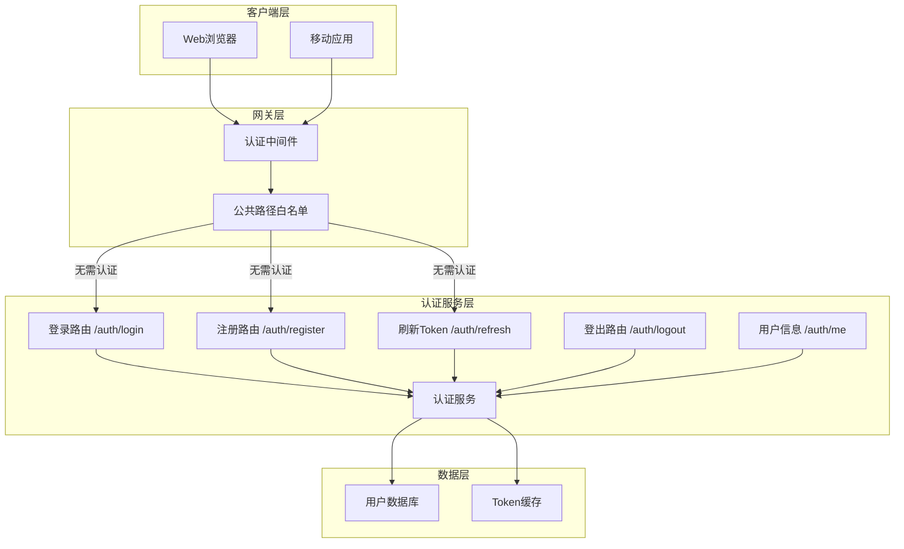
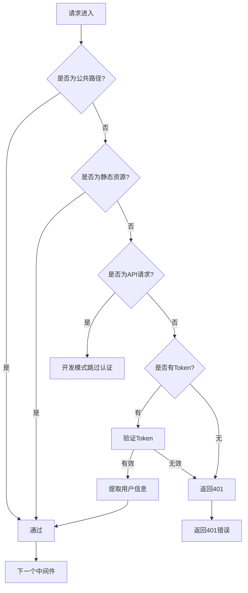

# 企业安全助手 - 登录与认证授权功能设计文档

**版本**: v1.0  
**创建日期**: 2026-04-11

---

## 1. 架构目标

### 1.1 设计目标

- 实现完整的用户登录与认证授权功能
- 修复静态资源访问401错误
- 确保API接口安全性
- 支持Token刷新和登出功能

### 1.2 架构原则

- 单一职责：登录相关逻辑集中在认证服务
- 开闭原则：易于扩展第三方认证
- 依赖倒置：认证逻辑依赖抽象接口

---

## 2. 系统架构

### 2.1 整体架构图



### 2.2 架构分层

#### 2.2.1 表示层

- Web应用：静态HTML页面
- API接口：FastAPI路由

#### 2.2.2 业务层

- 认证服务：AuthService
- Token管理：创建、验证、刷新、撤销

#### 2.2.3 数据层

- PostgreSQL：用户信息存储
- 内存缓存：Token黑名单

---

## 3. 服务设计

### 3.1 认证路由设计

| 路由 | 方法 | 描述 | 认证要求 |
|------|------|------|----------|
| /api/v1/auth/register | POST | 用户注册 | 公开 |
| /api/v1/auth/login | POST | 用户登录 | 公开 |
| /api/v1/auth/refresh | POST | 刷新Token | 公开 |
| /api/v1/auth/logout | POST | 用户登出 | 需要 |
| /api/v1/auth/me | GET | 获取当前用户信息 | 需要 |

### 3.2 认证中间件设计



### 3.3 认证白名单

```python
# 需要跳过的公共路径
PUBLIC_PATHS = [
    "/health",
    "/api/v1/health", 
    "/",
    "/docs",
    "/redoc",
    "/openapi.json",
    "/favicon.ico",
    "/api/v1/auth/register",
    "/api/v1/auth/login",
    "/api/v1/auth/refresh",
    "/static",
]
```

---

## 4. API设计

### 4.1 用户登录接口

- **URL**: `/api/v1/auth/login`
- **Method**: POST
- **描述**: 用户登录接口

**请求体**:

```json
{
  "username": "string, 用户名，必填",
  "password": "string, 密码，必填",
  "tenant_id": "string, 租户ID，可选"
}
```

**响应格式**:

```json
{
  "code": 200,
  "message": "登录成功",
  "data": {
    "access_token": "string, 访问令牌",
    "refresh_token": "string, 刷新令牌",
    "token_type": "Bearer",
    "expires_in": 1800
  }
}
```

### 4.2 用户注册接口

- **URL**: `/api/v1/auth/register`
- **Method**: POST
- **描述**: 用户注册接口

**请求体**:

```json
{
  "username": "string, 用户名，必填",
  "password": "string, 密码，必填",
  "email": "string, 邮箱，可选",
  "tenant_id": "string, 租户ID，必填"
}
```

**响应格式**:

```json
{
  "code": 201,
  "message": "注册成功",
  "data": {
    "user_id": "string, 用户ID",
    "username": "string, 用户名"
  }
}
```

### 4.3 刷新Token接口

- **URL**: `/api/v1/auth/refresh`
- **Method**: POST
- **描述**: 刷新访问令牌

**请求体**:

```json
{
  "refresh_token": "string, 刷新令牌，必填"
}
```

**响应格式**:

```json
{
  "code": 200,
  "message": "Token刷新成功",
  "data": {
    "access_token": "string, 新访问令牌",
    "token_type": "Bearer",
    "expires_in": 1800
  }
}
```

### 4.4 登出接口

- **URL**: `/api/v1/auth/logout`
- **Method**: POST
- **描述**: 用户登出，使当前Token失效

**请求头**:

```
Authorization: Bearer <access_token>
```

**响应格式**:

```json
{
  "code": 200,
  "message": "登出成功"
}
```

### 4.5 获取用户信息

- **URL**: `/api/v1/auth/me`
- **Method**: GET
- **描述**: 获取当前登录用户信息

**请求头**:

```
Authorization: Bearer <access_token>
```

**响应格式**:

```json
{
  "code": 200,
  "data": {
    "user_id": "string, 用户ID",
    "username": "string, 用户名",
    "email": "string, 邮箱",
    "tenant_id": "string, 租户ID",
    "role": "string, 角色",
    "permissions": ["string, 权限列表"],
    "is_active": true
  }
}
```

---

## 5. 数据架构

### 5.1 用户表扩展

需要在User表中添加password_hash字段：

| 字段 | 类型 | 说明 |
|------|------|------|
| password_hash | String(255) | bcrypt加密后的密码 |

### 5.2 Token设计

**Access Token载荷**:

```json
{
  "user_id": "用户ID",
  "tenant_id": "租户ID",
  "role": "用户角色",
  "permissions": ["权限列表"],
  "type": "access",
  "exp": "过期时间戳",
  "iat": "签发时间戳"
}
```

**Refresh Token载荷**:

```json
{
  "user_id": "用户ID",
  "type": "refresh",
  "exp": "过期时间戳",
  "iat": "签发时间戳"
}
```

---

## 6. 关键设计决策

### 6.1 认证策略

- 密码存储：使用bcrypt加密，工作因子12
- Token格式：JWT (HS256)
- Token有效期：Access Token 30分钟，Refresh Token 7天

### 6.2 静态资源处理

在认证中间件中添加对静态资源和favicon.ico的跳过逻辑：

```python
# 跳过静态文件
if request.url.path.startswith("/static"):
    return await call_next(request)

# 跳过favicon
if request.url.path == "/favicon.ico":
    return await call_next(request)
```

### 6.3 开发模式

在开发环境下，可以选择跳过部分认证以方便调试：

```python
if settings.debug and request.url.path.startswith("/api/"):
    return await call_next(request)
```

---

## 7. 文件结构

```
src/
├── api/
│   ├── routes/
│   │   └── auth.py          # 认证路由（新建）
│   └── middleware/
│       └── auth.py          # 认证中间件（修改）
├── services/
│   └── auth_service.py     # 认证服务（新建）
└── database/
    └── models.py           # 数据模型（修改：添加password_hash）
```

---

## 8. 依赖项

- python-jose: JWT编解码
- passlib: 密码哈希
- bcrypt: bcrypt加密

---

## 9. 验收标准

### 9.1 功能验收

- [ ] 用户可以成功注册
- [ ] 用户可以成功登录并获取Token
- [ ] Token可以正常刷新
- [ ] 登出后Token失效
- [ ] /api/v1/auth/me返回当前用户信息
- [ ] 静态资源访问不返回401
- [ ] 无Token访问受保护接口返回401

### 9.2 安全验收

- [ ] 密码以bcrypt加密存储
- [ ] Token包含过期时间
- [ ] 登出后Token加入黑名单

---

## 10. 版本历史

| 版本 | 日期 | 修改内容 | 作者 |
|------|------|----------|------|
| v1.0 | 2026-04-11 | 初始版本 | 架构师 |
